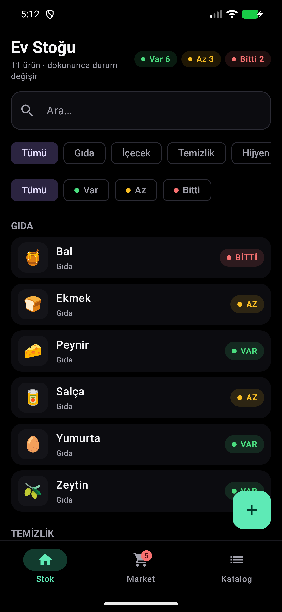
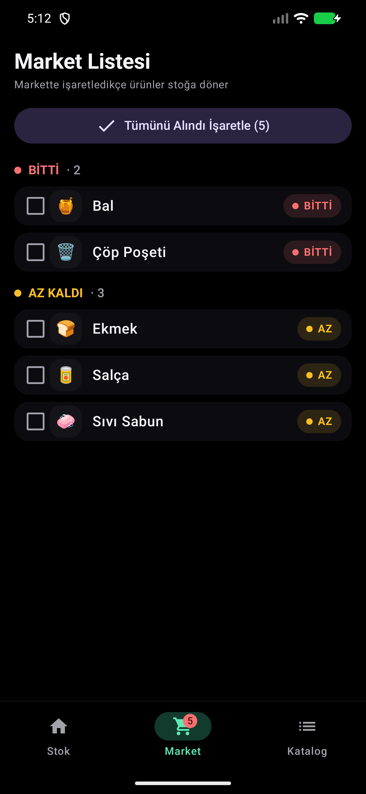
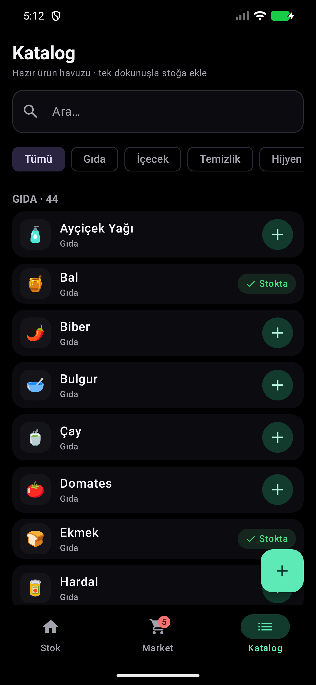

# Ev Stok (Home Stock)

**English** | [Türkçe](README.md)

A fully offline Android app that tracks household consumables (food, cleaning,
hygiene), turns whatever runs out into a shopping list with a single tap, and
pulls items back into stock after shopping.

- **Kotlin + Jetpack Compose** (Material 3)
- **Room** for on-device SQLite persistence
- **AMOLED dark theme** (true black background)
- No internet permission, no accounts, no sync — single user, zero friction

## Screenshots

| Stock | Shopping List | Catalog |
|---|---|---|
|  |  |  |

## How It Works

### Status-based tracking (no quantities)
The app never asks how many grams or rolls are left. Every item is in one of
three states:

| Status | Meaning |
|---|---|
| **VAR** (In stock) | All good |
| **AZ** (Low) | Running low — the buffer is wearing out |
| **BITTI** (Out) | Finished — appears on the shopping list |

Tapping an item in the stock list cycles its status in order:
`VAR → AZ → BITTI → VAR`. Long-pressing opens the edit/delete sheet.

### Buffer stock logic
For products bought in large bottles and refilled into smaller containers
(dispensers, soap dishes, etc.), the intermediate containers are not tracked.
The moment the main package goes into the trash, the item is marked **BITTI**;
the buffer in the dispenser tides you over until the next shopping trip. The
**AZ** state is the early warning that this buffer is running down.

### Automatic shopping list
Items marked BITTI/AZ show up in the "Market" tab by themselves:
- Check the box once an item is in your cart at the store → it returns to
  **VAR** and disappears from the list (tap "GERİ AL" / Undo to revert).
- "Mark All as Bought" resets everything in one move (check & reset).
- The red badge on the bottom bar shows how many items await purchase.

### Built-in catalog
~90 common household staples (cheese, tomato paste, liquid soap, toilet
paper…) are seeded on first launch. Add them to your stock with a single tap —
no typing the same product name over and over. Custom products created with
the (+) button are saved into the catalog permanently.

## Screens

1. **Stok (Stock)** — home inventory; search, category and status filters,
   live summary stats.
2. **Market** — the auto-generated shopping list (BITTI + LOW sections) with
   undo support.
3. **Katalog** — the ready-made product pool plus custom product creation.

## Building

Requirements: JDK 17+, Android SDK (compileSdk 35).

```bash
./gradlew assembleDebug        # debug APK → app/build/outputs/apk/debug/
./gradlew testDebugUnitTest    # unit tests
```

Or open the project in Android Studio and run it.

## Architecture

```
app/src/main/java/com/evstok/app/
├── EvStokApp.kt            # Application + dependency container (manual DI)
├── MainActivity.kt          # Single activity, bottom-bar navigation
├── data/                    # Room: entities/DAOs/database, seed catalog, repository
└── ui/
    ├── theme/               # AMOLED color scheme (true black)
    ├── components/          # StatusChip, filter rows, shared pieces
    ├── dialogs/             # add/edit item, confirm, action sheet
    ├── home/                # Stock screen + ViewModel
    ├── shopping/            # Shopping list screen + ViewModel
    └── catalog/             # Catalog screen + ViewModel
```

- MVVM: each screen owns its `ViewModel`; the UI is fed reactively from Room
  `Flow`s, with the database as the single source of truth.
- The `catalog` table holds the product pool; the `stock` table holds the
  items the user tracks (locale-aware Turkish alphabetical ordering via
  `Collator`).

## License

[MIT](LICENSE)
